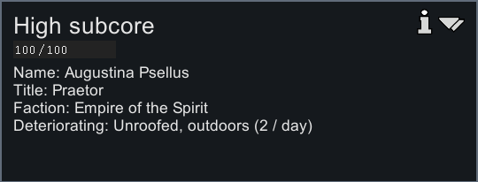
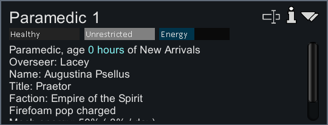
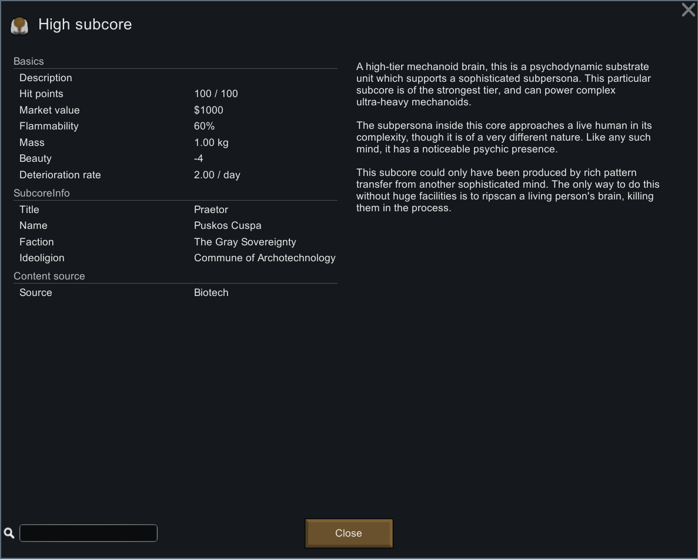
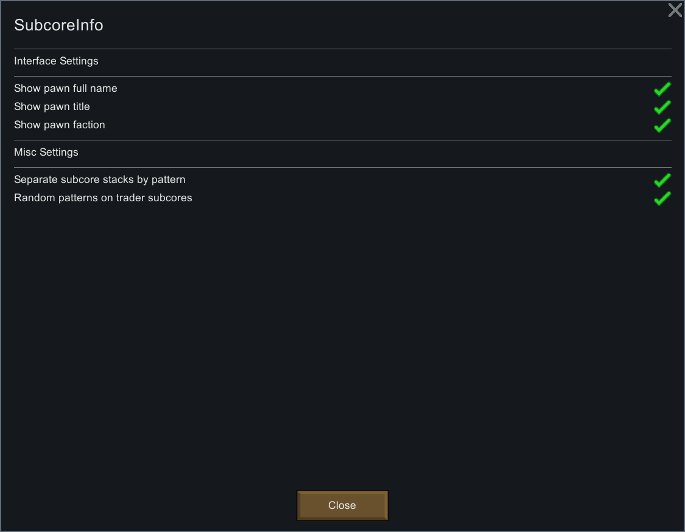

# 

Track which unfortunate pawn your subcores came from!







**This mod was inspired by the wonderful Mr Samuel Streamer and his Biotech series!**

## Features

- Subcores and mechs store info about scanned pawns
- Stored info: Title, Name, Faction, and Ideology
- Info is shown in the tooltip for subcores and mechs
- Scanning a pawn saves their info to the subcore
- Subcores from traders get random info generated
- Stored info is kept when disassembling mechs
- Info is 'Unknown' for existing or spawned subcores

## Existing Saves

This mod is safe to add or remove from saves!

Use this to add data to existing mechs or subcores in your save file:
```xml
<titleName>Supreme Leader</titleName>
<patternName Class="NameTriple">
	<first>Poor</first>
	<nick>Unfortunate</nick>
	<last>Pawn</last>
</patternName>
<factionName>Some Faction</factionName>
<ideoName>Some Ideology</ideoName>
```

## Bugs and Requests

Let me know if there are any bugs or requests, I'll happily do my best to fix them up!

MIT License | Open to contributions and suggestions!
