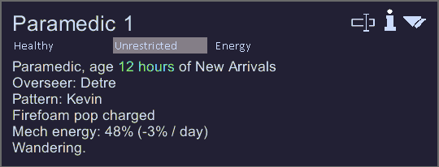
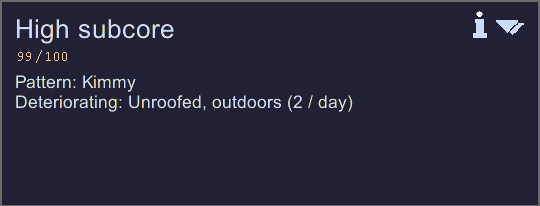

# 

Track which unfortunate pawn your subcores came from!




**This mod was inspired by the wonderful Mr Samuel Streamer and his Biotech series!**

## Features

- Subcores and mechs store scanned pawn name as pattern
- Pattern is shown in the tooltip for subcores and mechs
- Scanning a pawn saves their pattern to the subcore
- Subcores from traders get a random pattern
- Pattern is kept when disassembling mechs
- Pattern is 'Unknown' for existing or spawned subcores

## Existing Saves

This mod is safe to add or remove from saves!

Use this to give patterns to existing mechs or subcores in your save file:
```xml
<patternName Class="NameTriple">
	<first>Poor</first>
	<nick>Unfortunate</nick>
	<last>Pawn</last>
</patternName>
```

## Bugs and Requests

Let me know if there are any bugs or requests, I'll happily do my best to fix them up!

MIT License | Open to contributions and suggestions!
